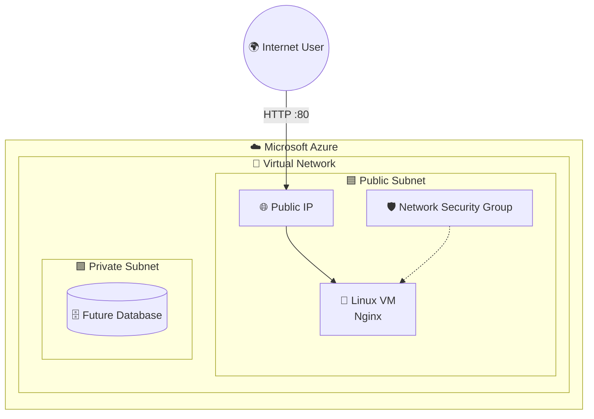
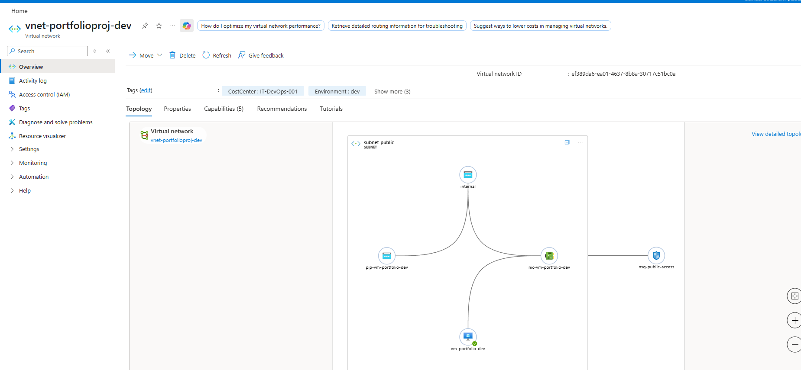
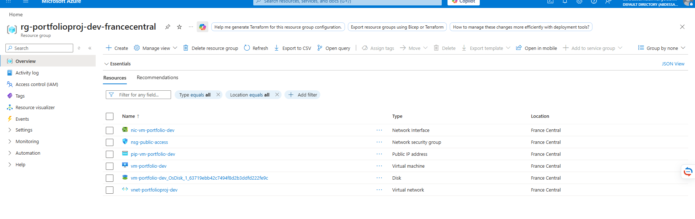
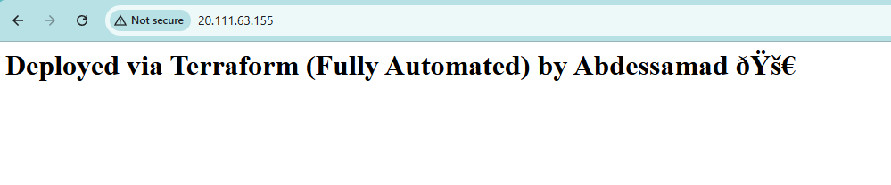

# ☁️ Azure Enterprise Infrastructure with Terraform

> **Infrastructure Cloud sécurisée, modulaire et prête pour la production sur Microsoft Azure**, conçue selon les standards **Enterprise / DevOps / FinOps**.

[](https://abdessamadmahjoubidevops.github.io/portfolio/)


<p align="center">
  
   3.0-0078D4?style=for-the-badge&logo=microsoft-azure" />
  
  
</p>

---

## 📌 Présentation

Ce projet déploie une **architecture Web 2‑tiers sécurisée** sur **Microsoft Azure**, entièrement automatisée avec **Terraform**, respectant les meilleures pratiques professionnelles :

- Sécurité by‑design
- Modularité & réutilisabilité
- Gouvernance Cloud
- FinOps & Tagging
- Prêt pour CI/CD & production

---

## ✨ Fonctionnalités Clés
### 🧩 Modularité
- Architecture Terraform **100 % modulaire**
- Modules réutilisables :
    - `network`
    - `compute`
---

### 🔐 Sécurité
- 🔑 Authentification **SSH uniquement**
- ❌ Aucun mot de passe stocké
- 🛡️ **NSG strictement configuré**
- 🔒 **Terraform Remote State**
- Azure Storage Account
- Verrouillage d’état (*State Locking*)

---


## 🏗️ Architecture Cloud

### 🔹 Vue d’ensemble



---

## 📂 Structure du Projet

```

├── modules/                  # Modules réutilisables (Network, Compute)
├── environments/             # Environnements (Dev, Prod...)
│   └── dev/
│       ├── main.tf           # Point d'entrée
│       ├── provider.tf       # Backend Azure Storage
│       └── terraform.tfvars  # Variables (Région, Projet...)
└── README.md                 # Documentation

```


## 🚀 Déploiement
### ✅ Pré‑requis
- Terraform ≥ 1.10
- Azure CLI installé
- Authentification Azure :

```bash
az login
git clone https://github.com/AbdessamadMAHJOUBIdevops/azure-terraform-enterprise-architecture.git
cd azure-enterprise-project/environments/dev
terraform init
terraform plan
terraform apply 

```

---


 

<!-- BEGIN_TF_DOCS -->
## 🔧 Technical Documentation

This section is automatically generated by terraform-docs.

## Requirements

| Name | Version |
|------|---------|
| <a name="requirement_azurerm"></a> [azurerm](#requirement\_azurerm) | ~> 3.0 |

## Providers

| Name | Version |
|------|---------|
| <a name="provider_azurerm"></a> [azurerm](#provider\_azurerm) | 3.117.1 |

## Modules

| Name | Source | Version |
|------|--------|---------|
| <a name="module_compute"></a> [compute](#module\_compute) | ../../modules/compute | n/a |
| <a name="module_network"></a> [network](#module\_network) | ../../modules/network | n/a |

## Resources

| Name | Type |
|------|------|
| [azurerm_resource_group.main](https://registry.terraform.io/providers/hashicorp/azurerm/latest/docs/resources/resource_group) | resource |

## Inputs

| Name | Description | Type | Default | Required |
|------|-------------|------|---------|:--------:|
| <a name="input_environment"></a> [environment](#input\_environment) | L'environnement (dev, staging, prod) | `string` | n/a | yes |
| <a name="input_project_name"></a> [project\_name](#input\_project\_name) | myApp | `string` | n/a | yes |
| <a name="input_location"></a> [location](#input\_location) | Localisation Azure francecentral | `string` | `"francecentral"` | no |

## Outputs

| Name | Description |
|------|-------------|
| <a name="output_app_url"></a> [app\_url](#output\_app\_url) | L'URL pour accéder à l'application |
| <a name="output_web_server_ip"></a> [web\_server\_ip](#output\_web\_server\_ip) | On veut afficher l'IP dans le terminal à la fin |
<!-- END_TF_DOCS -->


---

## 📸 Deployment Proof

Here is the visual evidence of the infrastructure deployed on Azure.

### 1. Azure Network Topology
*Visualization of the VNet, Subnets, and NIC associations.*


### 2. Resource Group Overview
*All resources managed by Terraform state.*


### 3. Application Live
*Nginx web server successfully bootstrapped via Cloud-init.*
