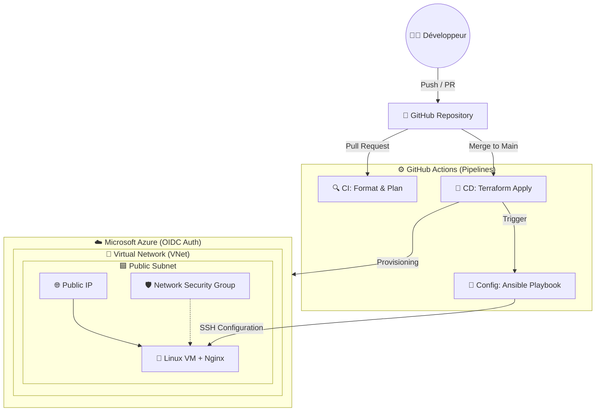
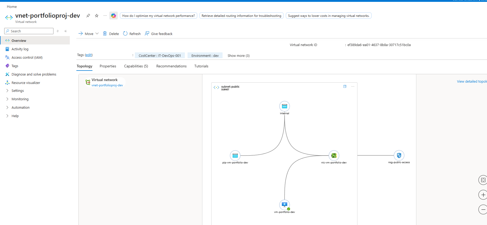
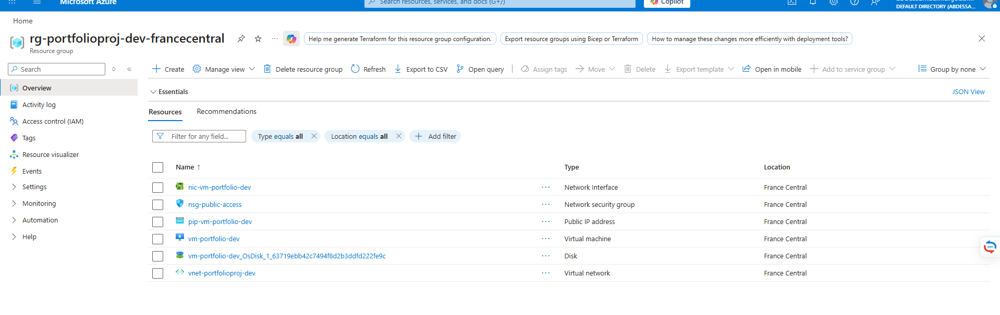
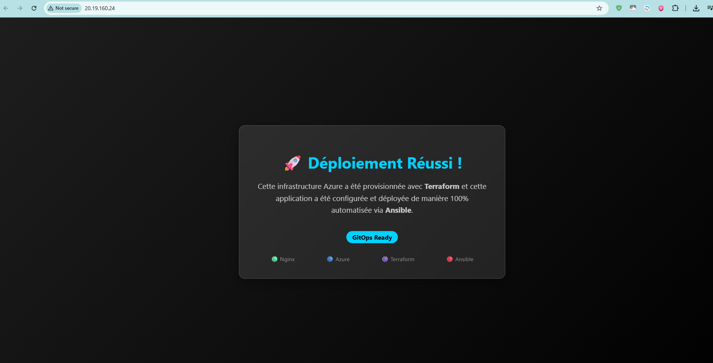

# ☁️ Azure Enterprise Infrastructure with Terraform & Ansible

> **Infrastructure Cloud sécurisée, modulaire et prête pour la production sur Microsoft Azure**, conçue selon les standards **Enterprise / DevOps / GitOps**.

[](https://abdessamadmahjoubidevops.github.io/portfolio/)

<p align="center">
  
  
  
   3.0-0078D4?style=for-the-badge&logo=microsoft-azure" />
  
</p>

---

## 📌 Présentation

Ce projet déploie une **architecture Web 2‑tiers sécurisée** sur **Microsoft Azure**, avec une approche **100% GitOps**. La création de l'infrastructure est gérée par **Terraform**, la configuration logicielle par **Ansible**, et l'ensemble du cycle de vie est automatisé via **GitHub Actions**.

- **Sécurité by‑design** : Authentification OIDC (Zero Trust) et flux réseau restreints.
- **GitOps & CI/CD** : Déploiement et destruction automatisés par pipelines.
- **Configuration dynamique** : Serveur Web configuré via des templates Jinja2 avec Ansible.
- **Gouvernance & FinOps** : Tagging systématique et bouton d'autodestruction pour maîtriser les coûts.

---

## ✨ Fonctionnalités Clés

### 🤖 CI/CD & GitOps (GitHub Actions)
- **CI (Garde du corps)** : Formatage, validation et `terraform plan` sur chaque Pull Request.
- **CD (Déploiement Continu)** : `terraform apply` automatique lors du merge sur la branche `main`.
- **FinOps (Bouton Rouge)** : Workflow de destruction manuelle (`workflow_dispatch`) pour économiser les crédits Cloud.

### ⚙️ Configuration Management (Ansible)
- Déploiement "Agentless" via SSH sécurisé.
- Utilisation de **Variables** et de **Templates Jinja2** pour une configuration Nginx dynamique.
- Gestion de l'idempotence avec les **Handlers** (redémarrage du service uniquement si modification).

### 🧩 Infrastructure as Code (Terraform)
- Architecture **100 % modulaire** (`network`, `compute`).
- **Remote Backend** sur Azure Storage Account avec State Locking.

### 🔐 Sécurité
- 🔑 Authentification Cloud via **OIDC (OpenID Connect)** : Aucun secret Azure stocké dans GitHub.
- 🛡️ **NSG strictement configuré** (Ports 22 et 80 uniquement).
- 🤫 Injection de clés SSH dynamiques dans les runners CI/CD.

---

## 🏗️ Architecture Cloud & GitOps

### 🔹 Vue d’ensemble du Workflow


```mermaid
graph TD
    Dev((👨‍💻 Développeur)) -->|Push / PR| GitHub[🐙 GitHub Repository]
    
    subgraph CI_CD["⚙️ GitHub Actions (Pipelines)"]
        CI[🔍 CI: Format & Plan]
        CD[🚀 CD: Terraform Apply]
        Ans[🎨 Config: Ansible Playbook]
    end

    GitHub -->|Pull Request| CI
    GitHub -->|Merge to Main| CD
    CD -->|Trigger| Ans

    subgraph Azure["☁️ Microsoft Azure (OIDC Auth)"]
        subgraph VNet["🔐 Virtual Network (VNet)"]
            subgraph PublicSubnet["🟦 Public Subnet"]
                PIP[🌐 Public IP] --> VM[🐧 Linux VM + Nginx]
                NSG[🛡️ Network Security Group] -.-> VM
            end
        end
    end

    CD -->|Provisioning| Azure
    Ans -->|SSH Configuration| VM

```

---

## 📂 Structure du Projet

```

├── .github/
│   └── workflows/            # Pipelines CI/CD (Plan, Apply, Destroy)
├── ansible/                  # Configuration Management
│   ├── files/                # Code source de la WebApp (HTML/CSS)
│   ├── templates/            # Fichiers de configuration dynamiques (Jinja2)
│   ├── deploy-webapp.yml     # Playbook principal
│   └── inventory.ini         # Inventaire des cibles Azure
├── environments/             # Environnements Terraform (Dev, Prod...)
│   └── dev/
│       ├── main.tf           # Point d'entrée
│       ├── provider.tf       # Backend Azure Storage & Provider OIDC
│       └── terraform.tfvars  # Variables (Région, Projet...)
├── modules/                  # Modules réutilisables Terraform (Network, Compute)
└── README.md                 # Documentation
```


## 🚀 Déploiement 
Ce projet est conçu pour être déployé exclusivement via GitHub Actions (GitOps).

1. #### Forker ou cloner ce dépôt

2. ####  Configurer les GitHub Secrets :

- ✅AZURE_CLIENT_ID, AZURE_TENANT_ID, AZURE_SUBSCRIPTION_ID (Pour OIDC).

- ✅AZURE_SSH_PUBLIC_KEY (Pour Terraform).

- ✅AZURE_SSH_PRIVATE_KEY (Pour Ansible).

3. #### Pousser sur la branche `main`  pour déclencher le provisionnement de bout en bout.

4. #### Utiliser le workflow `Terraform Destroy` pour décommissionner l'infrastructure.

```
```


 

<!-- BEGIN_TF_DOCS -->
## 🔧 Technical Documentation

This section is automatically generated by terraform-docs.

## Requirements

| Name | Version |
|------|---------|
| <a name="requirement_azurerm"></a> [azurerm](#requirement\_azurerm) | ~> 3.0 |

## Providers

| Name | Version |
|------|---------|
| <a name="provider_azurerm"></a> [azurerm](#provider\_azurerm) | 3.117.1 |

## Modules

| Name | Source | Version |
|------|--------|---------|
| <a name="module_compute"></a> [compute](#module\_compute) | ../../modules/compute | n/a |
| <a name="module_network"></a> [network](#module\_network) | ../../modules/network | n/a |

## Resources

| Name | Type |
|------|------|
| [azurerm_resource_group.main](https://registry.terraform.io/providers/hashicorp/azurerm/latest/docs/resources/resource_group) | resource |

## Inputs

| Name | Description | Type | Default | Required |
|------|-------------|------|---------|:--------:|
| <a name="input_environment"></a> [environment](#input\_environment) | L'environnement (dev, staging, prod) | `string` | n/a | yes |
| <a name="input_project_name"></a> [project\_name](#input\_project\_name) | myApp | `string` | n/a | yes |
| <a name="input_location"></a> [location](#input\_location) | Localisation Azure francecentral | `string` | `"francecentral"` | no |

## Outputs

| Name | Description |
|------|-------------|
| <a name="output_app_url"></a> [app\_url](#output\_app\_url) | L'URL pour accéder à l'application |
| <a name="output_web_server_ip"></a> [web\_server\_ip](#output\_web\_server\_ip) | On veut afficher l'IP dans le terminal à la fin |
<!-- END_TF_DOCS -->


---

## 📸 Deployment Proof

Here is the visual evidence of the infrastructure deployed on Azure.

### 1. Azure Network Topology
*Visualization of the VNet, Subnets, and NIC associations.*


### 2. Resource Group Overview
*All resources managed by Terraform state.*


### 3. Application Live
*Nginx web server successfully bootstrapped via Cloud-init.*
